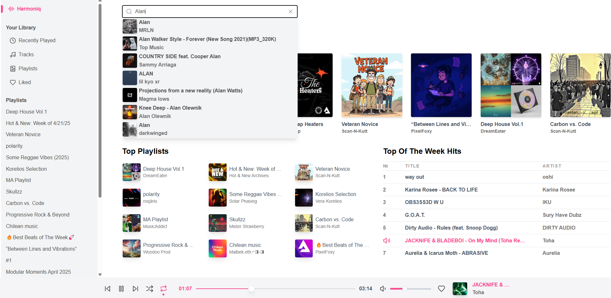
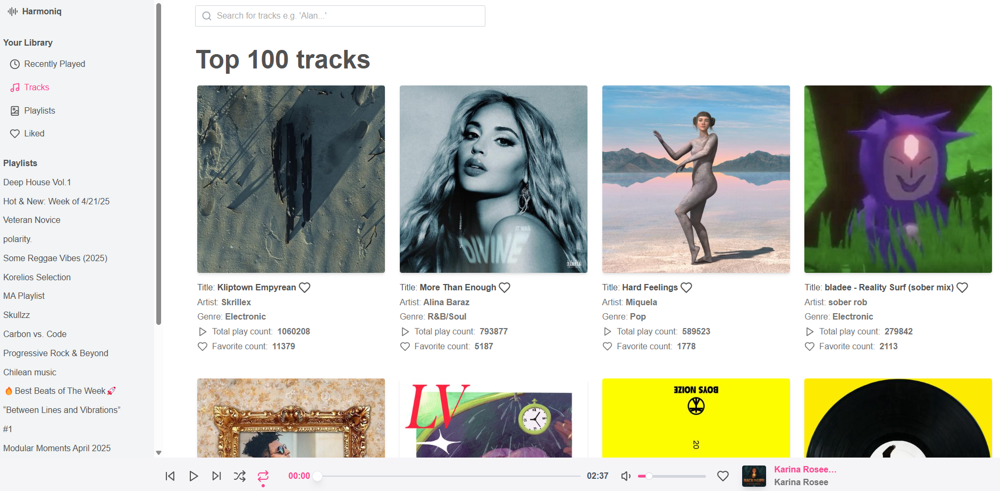
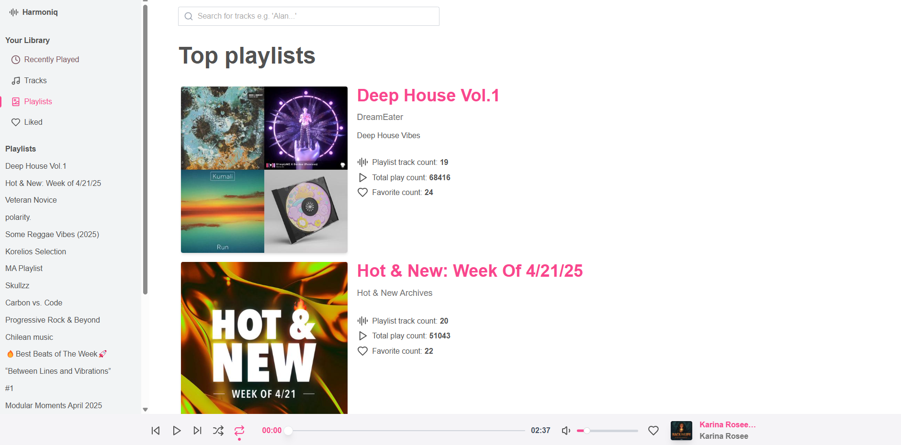
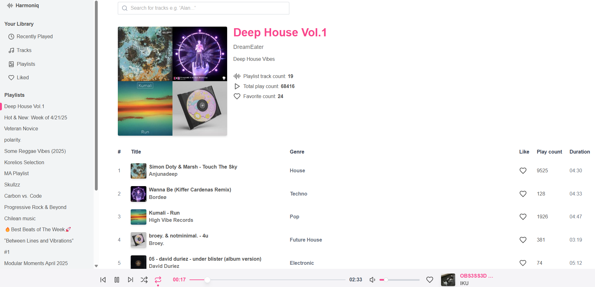
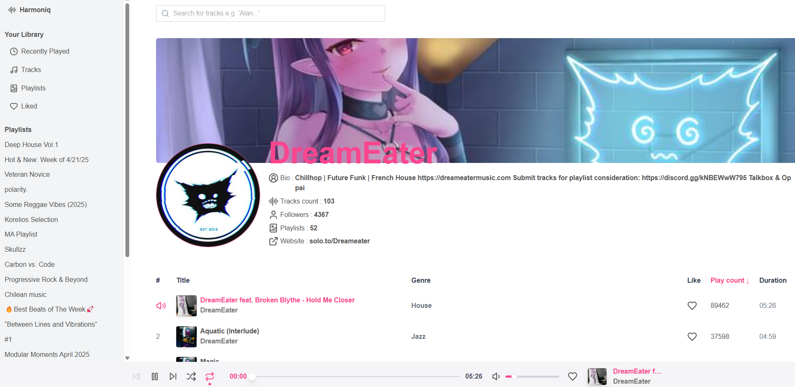
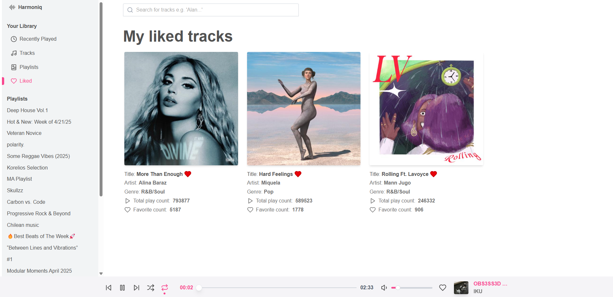
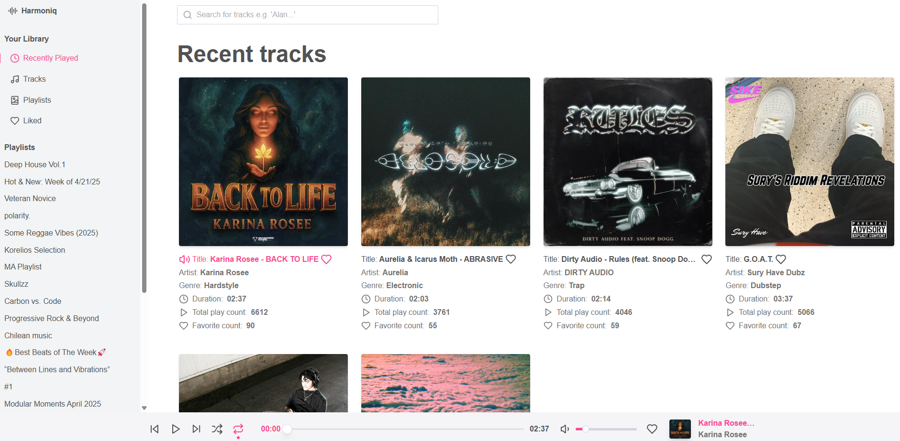

# 🎵 Harmoniq

A fully responsive music player built with **Next.js 15, React, TypeScript, Zustand, and Tailwind CSS**. It fetches music data from the **[Audius API](https://audiusproject.github.io/api-docs)** and provides a smooth, modern listening experience.

## 🚀 Features

- 🎧 Full-featured music player with play bar, track controls, and playlist support

- 📱 Responsive design — works seamlessly on desktop and mobile

- 🏠 Home page, User pages, Playlist pages, and Track pages

- 🔥 Dedicated sections for:

  - Recent tracks

  - Favorite tracks

  - Top playlists

  - Top tracks

- ⚡ Powered by the **Audius API** for real-time music data

- ⚙️ Built with:

  - Next.js 15 App Router

  - React

  - TypeScript

  - Zustand for state management

  - Tailwind CSS for styling

## 📸 Screenshots















## 🧩 Getting Started

Clone the repo and install dependencies:

```bash
git clone https://github.com/dumkaguv/Harmoniq.git
cd Harmoniq
npm install
```

Then run the development server:

```bash
npm run dev
```

Set up your environment variables in the `.env` file.

Open http://localhost:3000 in your browser.